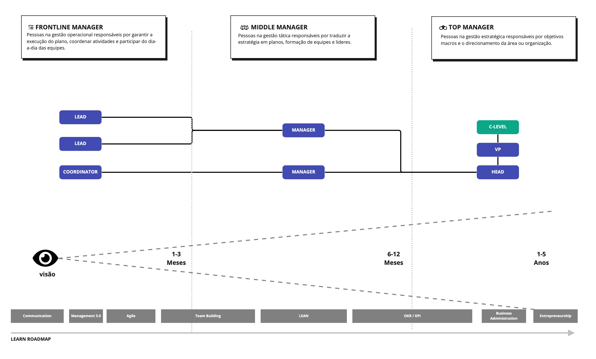

# Os 3 Níveis da Gestão

Muitos acreditam que gestão é tudo igual, mas a realidade é bem diferente, dentro de uma organização é preciso ter pessoas gerenciando o operacional, tático e estratégico. Cada uma dessas camadas da gestão pode ter atuações diferentes.

## Front-line Manager

Pessoas na gestão operacional responsáveis por garantir a execução do plano, coordenar atividades e participar do dia-a-dia das equipes.

Planejamento:

- 1-3 Meses (curto-prazo)

Atuações Comuns:

- Dia-a-dia da equipe
- Atividades de curto-prazo
- Remover impedimentos
- Definição de prioridade
- Entrevistas

Conhecimentos Recomendados:

- Comunicação
- Management 3.0
- Agile
- Team building

## Middle Manager

Pessoas na gestão tática responsáveis por traduzir a estratégia em planos, formação de equipes e lideres.

Planejamento:

- 6-12 Meses (médio-prazo)

Atuações Comuns:

- Formação de equipes e novos lideres
- Tradução de estratégia em plano de ação
- Gestão de orçamento* 
- Definição de prioridade
- Entrevistas

Conhecimentos Recomendados:

- Comunicação
- Management 3.0
- Agile
- Team building
- Lean
- OKR (Ou ferramenta de metas da org)
- KPI
- Roadmap

## Top Manager

Pessoas na gestão estratégica responsáveis por objetivos macros e o direcionamento da área ou organização.

Planejamento:

- 1-5 Anos (longo-prazo)

Atuações Comuns:

- Visão estratégica da área e/ou empresa
- Gestão de orçamento* 
- Definição de prioridade
- Entrevistas
- Construção de áreas

Conhecimentos Recomendados:

- Comunicação
- Blitzscaling
- Company Bets
- North Star
- Lean
- OKR (Ou ferramenta de metas da org)
- KPI
- Roadmap
- Management 3.0

## Futuro

Um dos grandes desafios sobre a gestão é como empresas pequenas conseguem dar conta do operacional até o estratégico sem perder o foco no que cada um deveria se preocupar. Há formas de lidar com esses desafios com menos hierarquia e custo? Tentarei construir essa visão na próxima versão, utilizando conceitos da Holocracia.
